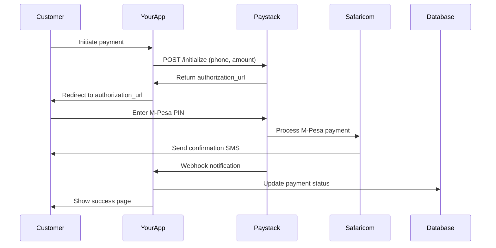

# Kenya M-Pesa Integration Guide

This guide explains how to use Paystack for M-Pesa payments in Kenya.

## Overview

This payment gateway uses **Paystack** to process M-Pesa payments in Kenya. Paystack handles M-Pesa through their `mobile_money` payment channel, making integration simpler than using Safaricom's Daraja API directly.

## Why Paystack for M-Pesa?

✅ **Simpler Integration** - No need to deal with Safaricom's complex Daraja API  
✅ **Unified Platform** - Handle M-Pesa, cards, and bank transfers in one place  
✅ **Automatic Reconciliation** - Paystack handles payment tracking  
✅ **Webhook Support** - Real-time payment notifications  
✅ **Lower Technical Overhead** - Paystack manages certificates, tokens, and API changes  

## Setting Up Paystack for Kenya

### 1. Create Paystack Account (Kenya)
1. Go to [https://paystack.com/ke](https://paystack.com/ke)
2. Sign up with your Kenyan business details
3. Complete KYC verification (required for live payments)

### 2. Get API Keys
1. Log in to [https://dashboard.paystack.com/](https://dashboard.paystack.com/)
2. Go to **Settings → API Keys & Webhooks**
3. Copy your keys:
   - **Test Secret Key**: `sk_test_xxxxx` (for development)
   - **Live Secret Key**: `sk_live_xxxxx` (for production)

### 3. Configure Environment
```bash
# In your .env file
PAYSTACK_SECRET_KEY=sk_test_your_key_here
DEFAULT_CURRENCY=KES
```

## M-Pesa Payment Flow

### Standard Flow (Customer Pays)

```
1. Customer provides: Phone number (254XXXXXXXXX) + Amount
2. Your app calls: POST /api/v1/c2b/mpesa/initialize
3. Paystack returns: Authorization URL
4. Customer visits URL or receives STK push
5. Customer enters M-Pesa PIN on their phone
6. Payment completes
7. Webhook notifies your system
8. Verify payment: GET /api/v1/c2b/verify/{reference}
```

## API Endpoints for M-Pesa

### 1. Initialize M-Pesa Payment (Simplified)

**Endpoint:** `POST /api/v1/c2b/mpesa/initialize`

**Request:**
```json
{
  "phone_number": "254712345678",
  "email": "customer@example.com",
  "amount": 100,
  "description": "Payment for Order #123"
}
```

**Response:**
```json
{
  "status": "success",
  "message": "M-Pesa payment initialized",
  "data": {
    "authorization_url": "https://checkout.paystack.com/xyz",
    "access_code": "xyz123",
    "reference": "MPESA-ABC123",
    "payment_id": 1,
    "amount_kes": 100.0,
    "phone_number": "254712345678",
    "instructions": "Customer will receive M-Pesa prompt on their phone"
  }
}
```

### 2. Initialize Payment (Full Options)

**Endpoint:** `POST /api/v1/c2b/initialize`

**Request:**
```json
{
  "phone_number": "254712345678",
  "email": "customer@example.com",
  "amount": 10000,
  "currency": "KES",
  "channels": ["mobile_money"],
  "description": "Payment for services",
  "callback_url": "https://yoursite.com/payment/callback",
  "metadata": {
    "order_id": "ORD-123",
    "customer_name": "John Doe"
  }
}
```

### 3. Verify Payment

**Endpoint:** `GET /api/v1/c2b/verify/{reference}`

**Response:**
```json
{
  "status": "success",
  "message": "Payment verified",
  "data": {
    "id": 1,
    "phone_number": "254712345678",
    "email": "customer@example.com",
    "amount": 10000,
    "currency": "KES",
    "status": "SUCCESS",
    "payment_provider": "PAYSTACK",
    "channel": "mobile_money",
    "reference": "MPESA-ABC123",
    "transaction_date": "2026-07-22T14:30:00"
  }
}
```

## Phone Number Format

M-Pesa phone numbers must be in **international format without the `+`**:

✅ **Correct:**
- `254712345678` (Safaricom)
- `254733456789` (Safaricom)
- `254755123456` (Airtel Money)

❌ **Wrong:**
- `+254712345678` (remove the +)
- `0712345678` (must include 254)
- `712345678` (must include 254)

## Amount Format

- **Amount in KES**: Use the actual amount (e.g., `100` for KES 100)
- The system automatically converts to cents for Paystack (100 KES = 10000 cents)

## Testing M-Pesa Payments

### Test Mode (Paystack Sandbox)

1. Use **test secret key** starting with `sk_test_`
2. Paystack provides a test environment for M-Pesa
3. Use test phone numbers provided by Paystack

**Test Numbers (Check Paystack docs for latest):**
```
Test M-Pesa: Check Paystack Kenya sandbox documentation
```

### Live Mode

1. Switch to **live secret key** (`sk_live_`)
2. Complete Paystack KYC verification
3. Use real M-Pesa phone numbers
4. Real money will be charged

## Webhook Configuration

### 1. Set Up Webhook URL

In Paystack Dashboard:
1. Go to **Settings → Webhooks**
2. Add URL: `https://yourdomain.com/api/v1/paystack/webhook`
3. Paystack will send real-time payment updates

### 2. Webhook Events

Your system handles these events:
- `charge.success` - Payment completed successfully
- `charge.failed` - Payment failed
- `transfer.success` - Payout completed
- `transfer.failed` - Payout failed

## Complete Example: M-Pesa Payment

### Using cURL

```bash
# Initialize M-Pesa payment
curl -X POST http://localhost:5000/api/v1/c2b/mpesa/initialize \
  -H "Content-Type: application/json" \
  -d '{
    "phone_number": "254712345678",
    "email": "customer@example.com",
    "amount": 100,
    "description": "Test Payment"
  }'

# Verify payment (after customer completes on their phone)
curl http://localhost:5000/api/v1/c2b/verify/MPESA-ABC123
```

### Using Python

```python
import requests

# Initialize payment
response = requests.post(
    'http://localhost:5000/api/v1/c2b/mpesa/initialize',
    json={
        'phone_number': '254712345678',
        'email': 'customer@example.com',
        'amount': 100,
        'description': 'Test Payment'
    }
)

data = response.json()
print(f"Payment Reference: {data['data']['reference']}")
print(f"Authorization URL: {data['data']['authorization_url']}")

# Verify payment
reference = data['data']['reference']
verify_response = requests.get(
    f'http://localhost:5000/api/v1/c2b/verify/{reference}'
)
print(verify_response.json())
```

### Using JavaScript (Frontend)

```javascript
// Initialize M-Pesa payment
async function initializeMpesaPayment() {
  const response = await fetch('/api/v1/c2b/mpesa/initialize', {
    method: 'POST',
    headers: { 'Content-Type': 'application/json' },
    body: JSON.stringify({
      phone_number: '254712345678',
      email: 'customer@example.com',
      amount: 100,
      description: 'Product Purchase'
    })
  });
  
  const data = await response.json();
  
  // Redirect to Paystack checkout
  window.location.href = data.data.authorization_url;
}

// Verify payment (on callback page)
async function verifyPayment(reference) {
  const response = await fetch(`/api/v1/c2b/verify/${reference}`);
  const data = await response.json();
  
  if (data.data.status === 'SUCCESS') {
    console.log('Payment successful!');
  }
}
```

## M-Pesa Payouts (B2C)

You can also send money FROM your business TO customers' M-Pesa accounts:

```bash
curl -X POST http://localhost:5000/api/v1/b2c/transfer/initiate \
  -H "Content-Type: application/json" \
  -d '{
    "type": "mobile_money",
    "name": "John Doe",
    "account_number": "254712345678",
    "amount": 50000,
    "currency": "KES",
    "reason": "Refund for order #123"
  }'
```

## Supported Payment Methods in Kenya

Through Paystack, you support:

1. **M-Pesa** (Safaricom) - Primary mobile money
2. **Airtel Money** - Alternative mobile money
3. **Bank Transfers** - Direct bank payments
4. **Cards** - Visa, Mastercard

## Transaction Limits

### M-Pesa Limits (Kenya)
- **Minimum**: KES 1
- **Maximum per transaction**: KES 150,000
- **Daily limit**: KES 300,000 (varies by M-Pesa tier)

Check current limits: [M-Pesa Tariffs](https://www.safaricom.co.ke/mpesa_rates)

## Fees

### Paystack Fees (Kenya)
- Check current rates: [Paystack Kenya Pricing](https://paystack.com/ke/pricing)
- Typical: 2.9% + KES 30 per transaction (verify with Paystack)

### M-Pesa Charges
- Customer may pay M-Pesa transaction fees
- Configure who pays (merchant or customer) in Paystack settings

## Security Best Practices

1. **Verify Webhooks**: Always verify webhook signatures
2. **Use HTTPS**: Never send payment data over HTTP in production
3. **Validate Phone Numbers**: Ensure correct format before processing
4. **Log Transactions**: Keep detailed logs for reconciliation
5. **Handle Timeouts**: M-Pesa payments can take 30-60 seconds

## Troubleshooting

### Payment Stuck in PENDING
- M-Pesa payments can take up to 60 seconds
- Customer may have cancelled on their phone
- Check Paystack dashboard for details

### Phone Number Rejected
- Ensure format is `254XXXXXXXXX` (12 digits)
- Remove spaces, dashes, or special characters
- Don't include the `+` sign

### Payment Failed
- Insufficient M-Pesa balance
- Customer cancelled the prompt
- Network timeout
- Wrong PIN entered multiple times

### Webhook Not Received
- Check webhook URL is publicly accessible
- Verify webhook signature verification is working
- Check Paystack dashboard for webhook delivery logs

## Going Live Checklist

- [ ] Complete Paystack KYC verification
- [ ] Switch to live API keys (`sk_live_`)
- [ ] Configure production webhook URL (HTTPS)
- [ ] Test with small real payments
- [ ] Set up transaction monitoring
- [ ] Configure email notifications
- [ ] Update customer support processes
- [ ] Prepare reconciliation procedures

## Support & Resources

- **Paystack Kenya Docs**: https://paystack.com/docs/payments/mobile-money
- **Paystack Support**: support@paystack.com
- **M-Pesa Kenya**: https://www.safaricom.co.ke/personal/m-pesa
- **API Status**: https://status.paystack.com/

## Sample Integration Flow



## Next Steps

1. **Get Paystack Account**: Sign up at [paystack.com/ke](https://paystack.com/ke)
2. **Test Integration**: Use test keys with small amounts
3. **Complete KYC**: Required before going live
4. **Launch**: Switch to live keys and start accepting payments

Happy coding! 🇰🇪 🚀
